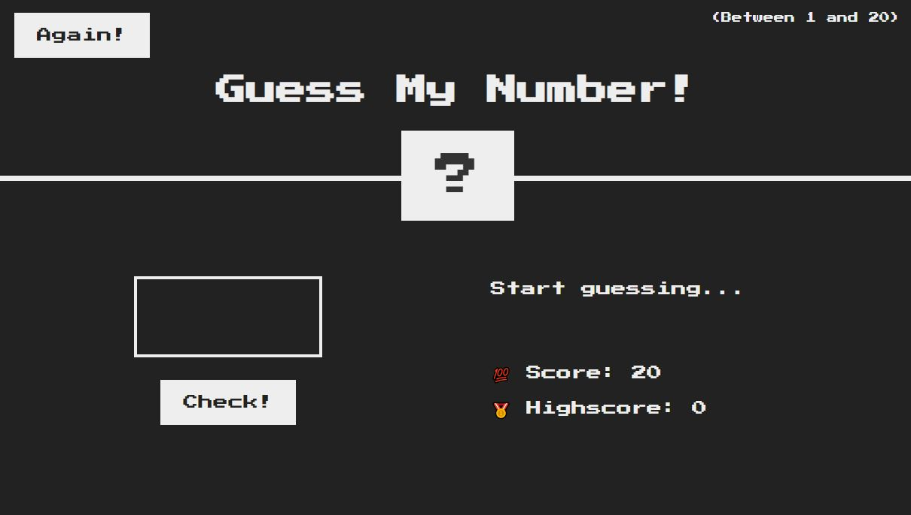
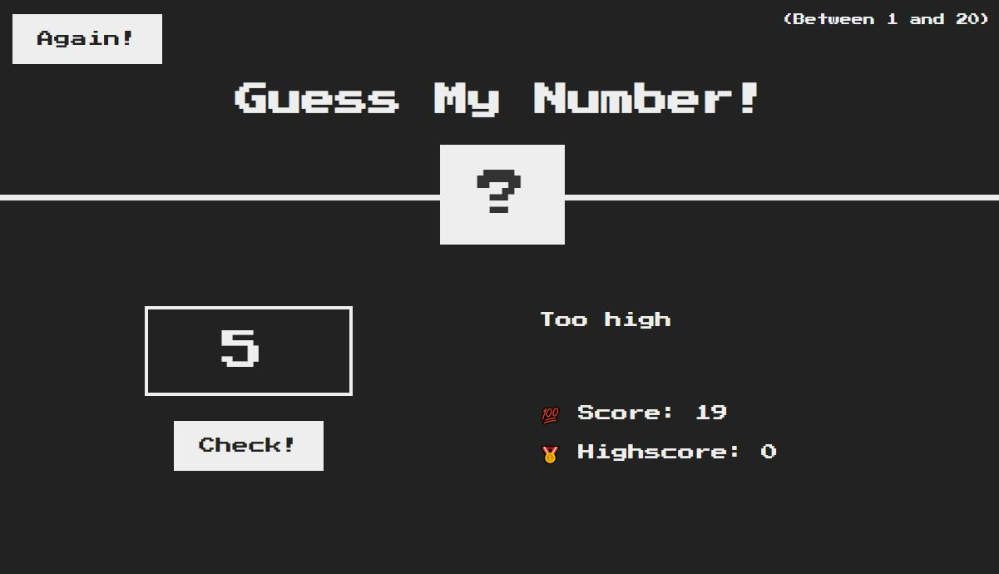
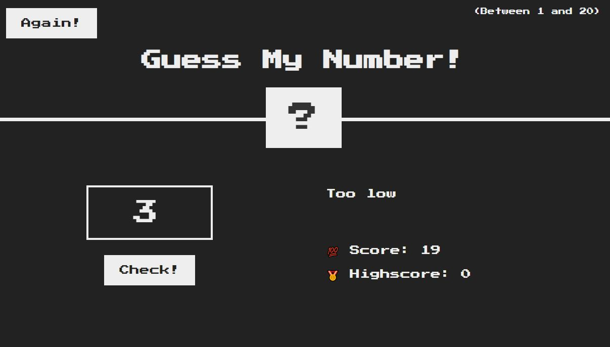
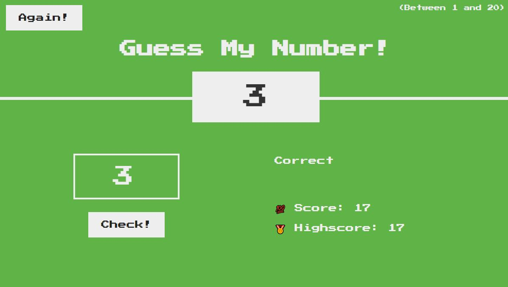

# Guess My Number

Guess My Number is a practice project from the JavaScript Course "Beginner to Expert" by Jonas Schmedtmann.

HTML and CSS was already provided by the course instructor. I implemented the JavaScript.

## Table of contents

- [Overview](#overview)
  - [About the game](#about-the-game)
  - [Screenshot](#screenshot)
  - [Links](#links)

## Overview

### About the game

A random number is generated between 1 and 20.

A player enters a guess and either receives the message of "Too low", "Too high" or "Correct".

The intitial highscore is calculated by 20 minus the amount of guesses taken.

### Screenshot

### Links

- Solution URL: [GitHub](https://github.com/Roneeey/GuessMyNumber)
- Live Site URL: [GitHub Pages](https://roneeey.github.io/GuessMyNumber/)
